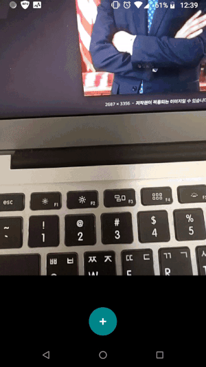

# Realtime Face Recognizer

This sample demonstrates realtime face recognition on Android. The project is based on the [FaceNet](https://arxiv.org/abs/1503.03832).

## Inspiration
The project is heavily inspired by
* [FaceNet](https://github.com/davidsandberg/facenet)
* [MTCNN](https://github.com/blaueck/tf-mtcnn)
* [Android LibSVM](https://github.com/yctung/AndroidLibSVM)
* [Tensorflow Android Camera Demo](https://github.com/tensorflow/tensorflow/tree/master/tensorflow/examples/android)

## Screenshots
The code can recognize 5 famous people's faces.[(Source)](https://github.com/pillarpond/facerecognizer/blob/master/app/src/main/assets/label)  
  

Also, you can add new person using photos.  

## Pre-trained model
from davidsandberg's facenet

| Model name      | LFW accuracy | Training dataset | Architecture |
|-----------------|--------------|------------------|-------------|
| [20180402-114759](https://drive.google.com/open?id=1EXPBSXwTaqrSC0OhUdXNmKSh9qJUQ55-) | 0.9965        | VGGFace2      | [Inception ResNet v1](https://github.com/davidsandberg/facenet/blob/master/src/models/inception_resnet_v1.py) |

## License
[Apache License 2.0](./LICENSE)
